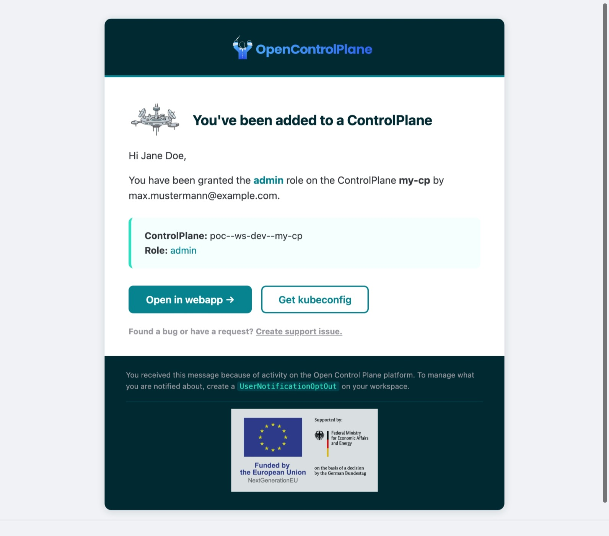
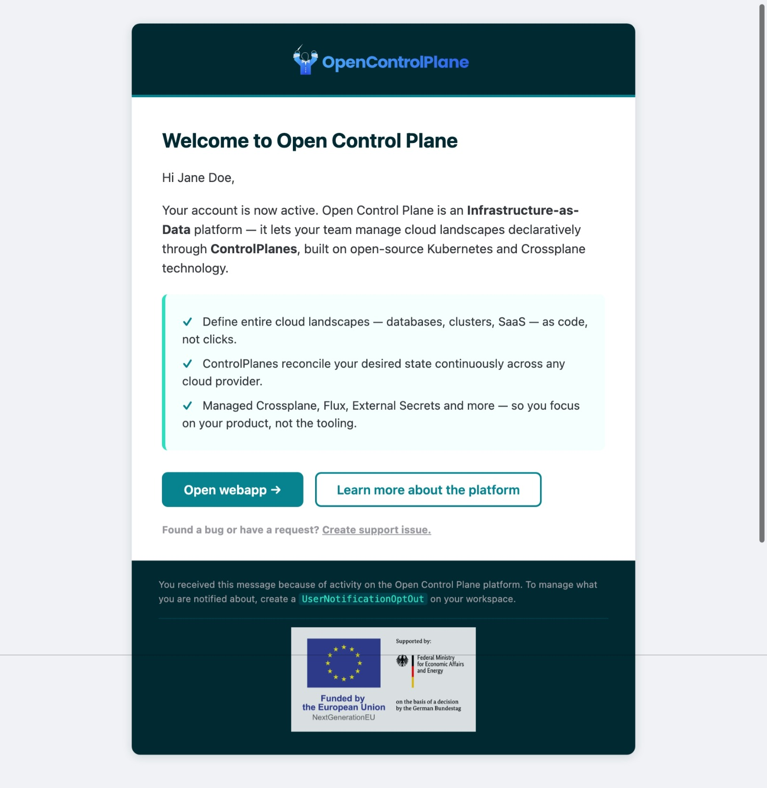
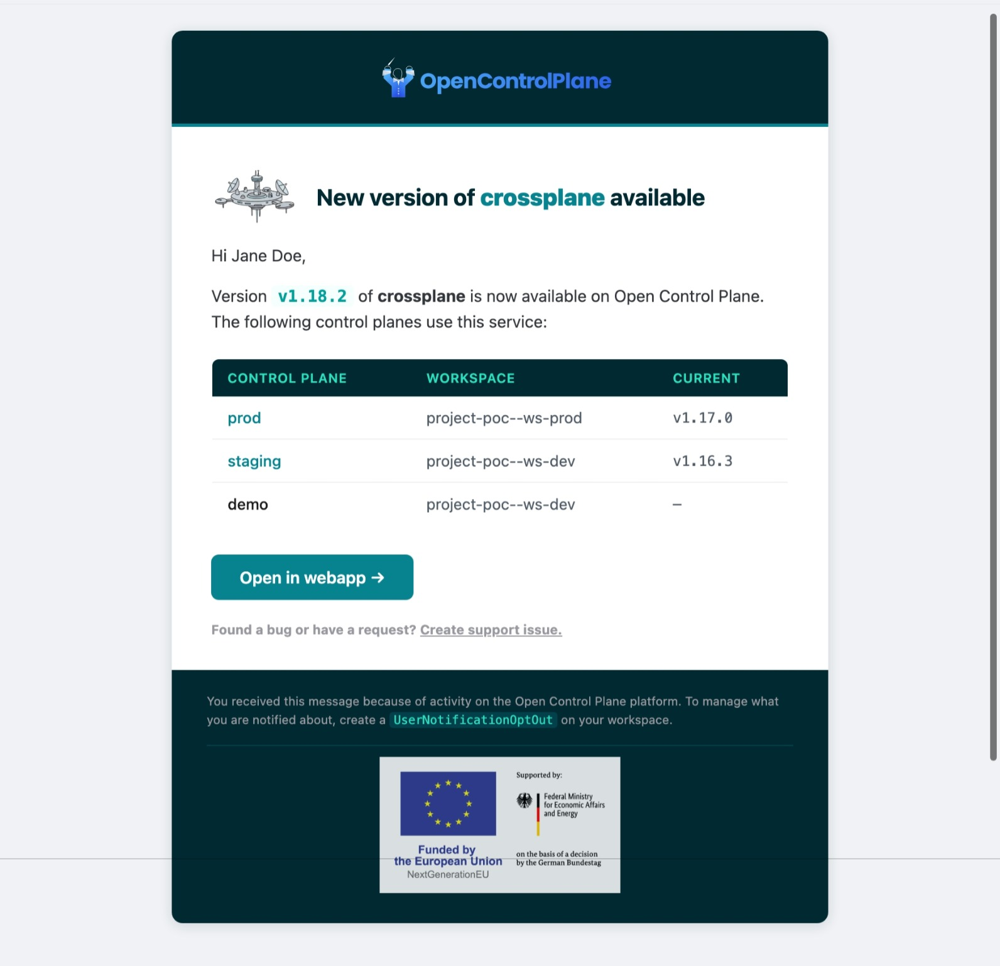

# platform-service-notifications

An [Open Control Plane](https://open-control-plane.io) (openmcp) **Platform Service** that keeps
users informed about what happens around them on the platform — starting with email.

## Purpose

This service notifies platform users about activity that concerns them:

- A user is added to a `Project`, `Workspace`, or `ControlPlane` → they get an email with a deep
  link to the resource.
- A user is seen on the platform for the first time → they get a one-time welcome / enablement
  email pointing at the docs.
- A newer version of a service becomes available → the admins of the affected `ControlPlane`s get
  **one aggregated digest each** (never one email per control plane).

Two guarantees underpin all of this:

- **No double-notifications.** Every notification is recorded; a user is never told about the
  same event twice, even across restarts, retries, or repeated reconciles.
- **Opt-out is always honored.** Project/workspace admins can mute resources; any member can
  silence their own notifications — all managed via CRDs on the onboarding cluster.

## What it notifies about

| Category | Trigger | Recipient | |
|---|---|---|---|
| `MembershipAdded` | A subject is added to a `Project`, `Workspace`, or (V2) `ControlPlane` | the added user |  |
| `UserEnablement` | A user is seen on the platform for the first time | the new user (once) |   |
| `NewServiceVersion` | A service's image (version) changes | admins of the affected ControlPlanes, **aggregated into one digest per admin** | |


## How it works

```
              PLATFORM cluster                         ONBOARDING cluster
  ┌───────────────────────────────────┐   ┌────────────────────────────────────┐
  │ NotificationConfig (singleton)     │   │ Project / Workspace / ControlPlane  │
  │ UserProfile   (email + registry)   │   │ ServiceProvider resources           │
  │ NotificationRecord (dedup ledger)  │   │ NotificationOptOut     (admin)      │
  │ ServiceProvider (version source)   │   │ UserNotificationOptOut (self-serve) │
  └───────────────────────────────────┘   └────────────────────────────────────┘
                 ▲     reconcilers watch  ─────────────────┘
                 │
     ┌───────────┴───────────────────────────────┐
     │ pipeline: suppress → dedup → render → send │
     │ Notifier: Email (SMTP, go-mail) [Slack …]  │
     └────────────────────────────────────────────┘
```

- **Persistence is Kubernetes-native.** Three CRDs (`openmcp.cloud/cluster=platform`) hold all
  state — no external database or queue. Everything goes through a small `Store` interface, so a
  different backend could be swapped in later without touching the reconcilers.
  - `NotificationConfig` — the platform-owner configuration (singleton, named after the provider).
  - `UserProfile` — one per user identity; doubles as the **registry**, the **email resolution**,
    and the **opt-out store**.
  - `NotificationRecord` — the **dedup ledger**; a deterministic record name derived from
    `hash(recipient + category + eventKey)` makes "create-or-AlreadyExists" the atomic
    delivery gate. Records are TTL-pruned (`recordRetention`, default 30 days).
- **Delivery** is behind a `Notifier` interface. Email is the first implementation
  ([github.com/wneessen/go-mail](https://github.com/wneessen/go-mail), `multipart/alternative`
  HTML + plaintext, STARTTLS/auth). Templates are rendered with `html/template` + `text/template`
  and embedded via `go:embed`.
- **Effectively-once** = at-least-once delivery + the dedup ledger. A `Pending`/`Failed` record is
  re-claimable so a transient SMTP failure retries; only `Delivered`/`Suppressed` are terminal.

## Configuring it as a platform operator

The service is deployed like any other openmcp Platform Service: the operator's cluster-scoped
`PlatformService` CR runs the image's `init` (installs CRDs, requests cluster access) and `run`
(the controller manager) commands. Everything below is applied to the **platform** cluster.

### 1. (Optional) SMTP credentials Secret

Create a Secret with `username` and `password` keys in the provider's namespace. Omit this
entirely for an unauthenticated relay (e.g. MailHog in tests).

```yaml
apiVersion: v1
kind: Secret
metadata:
  name: notifications-smtp
  namespace: openmcp-system   # the provider's namespace (POD_NAMESPACE)
type: Opaque
stringData:
  username: apikey
  password: "<smtp-password>"
```

### 2. The `NotificationConfig` singleton

The object's name **must equal the provider name** (`notifications`). It is cluster-scoped.

```yaml
apiVersion: notifications.platform.open-control-plane.io/v1alpha1
kind: NotificationConfig
metadata:
  name: notifications
spec:
  productName: Acme Cloud                        # shown in subjects/bodies (default "Open Control Plane")
  webappUrl: https://mycompany.eu                # base of the platform web UI (hash-router SPA)
  docsURL: https://mycompany.eu/help/            # user docs link, surfaced in the welcome email
  # usernameIsEmail: true                        # default: a User subject's Name is its email
  # enabledCategories: []                        # empty = all categories
  # enabledChannels: [Email]                     # default
  email:
    host: smtp.example.com
    port: 587                # default 587
    startTLS: true           # default true
    senderAddress: no-reply@example.com
    senderName: OpenMCP Notifications
    replyTo: platform-team@example.com
    secretRef:
      name: notifications-smtp    # omit for no-auth relays
  newVersionDigest:
    aggregationWindow: 1h    # collect affected control planes before sending one digest per admin
  recordRetention: 720h      # how long delivered records are kept (default 30d)
```

The `ConfigReconciler` applies this live: changing the config or its Secret hot-reloads the SMTP
settings without a restart, and the object reports a `Ready` condition once applied.

> **No `email` block?** The config still reaches `Ready`, but email delivery is inert until SMTP
> is configured. This is the smoke-test path exercised by the e2e suite.

### 3. Grant opt-out RBAC on the onboarding cluster

Apply the `ProjectWorkspaceConfig` described in
[docs/optout-rbac.md](docs/optout-rbac.md) once per platform deployment. This grants project and
workspace members the ability to create opt-out objects in their namespace.

### 4. Deploy via `PlatformService`

```yaml
apiVersion: openmcp.cloud/v1alpha1
kind: PlatformService
metadata:
  name: notifications
spec:
  image: ghcr.io/openmcp-project/images/platform-service-notifications:<version>
  initCommand: ["init"]
  runCommand: ["run"]
```

The `init` job requests **read-only** (`get;list;watch`) access on the onboarding cluster to
`projects`, `workspaces`, `controlplanes`, and (currently, broadly) other resources so it can
resolve the dynamically-typed service instances back to their ControlPlanes.

### Opt-out

Opt-out is self-service, driven by two CRDs on the **onboarding** cluster (where end users have
RBAC access). The namespace where the object lives determines its authorization scope; the
`spec.target` field makes the muted resource explicit.

**`NotificationOptOut`** — resource-wide, admin-managed. Mutes notifications for *all* recipients
on the targeted resource:

```yaml
# Mute all notifications for everyone in project "poc" (cascades to its workspaces/CPs).
# Created by a project admin in namespace "project-poc".
apiVersion: notifications.platform.open-control-plane.io/v1alpha1
kind: NotificationOptOut
metadata:
  name: poc-silent
  namespace: project-poc
spec:
  target:
    kind: Project
    name: poc
  # categories: [NewServiceVersion]   # omit to mute everything
```

**`UserNotificationOptOut`** — per-user self-service. Any member (including viewers) can mute
notifications for themselves on a specific resource:

```yaml
# Priya mutes version digests on one specific control plane.
# Created by priya (or a workspace admin) in namespace "project-poc--ws-dev".
apiVersion: notifications.platform.open-control-plane.io/v1alpha1
kind: UserNotificationOptOut
metadata:
  name: priya-no-digests-prod
  namespace: project-poc--ws-dev
spec:
  subject:
    kind: User
    name: priya@example.com
  target:
    kind: ControlPlane
    name: prod-cp
  categories: [NewServiceVersion]
```

**Cascade rules:**
- A `Project` target suppresses events for the project, all its workspaces, and all its control planes.
- A `Workspace` target suppresses events for that workspace and its control planes.
- A `ControlPlane` target suppresses only that specific control plane.

The opt-out check runs before dedup, so suppressed notifications are recorded with
`phase: Suppressed` in the `NotificationRecord` (still counted as delivered for dedup purposes).

See [docs/optout-rbac.md](docs/optout-rbac.md) for the `ProjectWorkspaceConfig` that grants
the required RBAC and a discussion of known limitations.

## Trying it in a local `ocpctl` test landscape

The e2e harness spins up a full openmcp landscape in **kind** (via
[`openmcp-testing`](https://github.com/openmcp-project/openmcp-testing)), loads a locally built
image of this service, deploys it as a `PlatformService`, and asserts behavior.

```shell
# 1. Build the provider image locally and run the e2e suite against a fresh kind landscape.
task test-e2e
```

`task test-e2e` (see [Taskfile.yaml](Taskfile.yaml)) builds
`ghcr.io/openmcp-project/images/platform-service-notifications:<version>` and hands it to the
harness in [test/e2e/main_test.go](test/e2e/main_test.go), which:

1. creates the platform cluster and installs the `openmcp-operator`,
2. registers the `kind` cluster provider,
3. deploys this service as the `notifications` `PlatformService` (with `LoadImageToCluster`),
4. runs [test/e2e/platformservice_test.go](test/e2e/platformservice_test.go): it creates the
   `NotificationConfig` singleton and waits for its `Ready` condition, then deletes it.

> If you run `go test ./test/e2e/...` directly you'll see
> *"image ... not present locally"* — the image must be built first, which is why `task test-e2e`
> is the entry point.

### Exercising real delivery locally

`task test-e2e-mailhog` spins up the full kind landscape, deploys a
[MailHog](https://github.com/mailhog/MailHog) SMTP relay into it, pre-wires the
`NotificationConfig` to send through MailHog, creates a test user, and asserts that the welcome
email arrives — all with zero manual setup.

```shell
# Run the delivery demo and tear down when done.
task test-e2e-mailhog

# Keep the landscape alive for hands-on exploration (Ctrl-C tears it down).
KEEP=1 task test-e2e-mailhog
```

When `KEEP=1` is set the test parks after the delivery assertion and prints the `kind` cluster
name together with the exact `kubectl port-forward` command to open the MailHog inbox on
**http://localhost:8025**.

While the landscape is live you can interact freely:

- Create more `UserProfile` objects → each one triggers a welcome email in MailHog.
- Edit `NotificationConfig` (e.g. set `productName`) → the service hot-reloads within seconds.
- Create a `UserNotificationOptOut` for a user → subsequent emails are suppressed;
  check the `NotificationRecord` status (`phase: Suppressed`).
- Bump a `ServiceProvider` image tag → admins of affected ControlPlanes receive a digest.

This full delivery scenario is the current e2e milestone; the config-smoke suite (`task test-e2e`)
remains the CI gate.

## Development

```shell
go build ./...        # build
go vet ./...          # vet
go test ./internal/...  # unit tests (pipeline, dedup keys, controller helpers, template render)
task test-e2e         # full kind-based e2e
```

Unit tests cover the delivery pipeline (dedup, suppression, address resolution, send-failure
retry), the opt-out resolver (cascade rules, category subsets, subject matching, workspace
isolation), the dedup/profile key derivation, the membership/admin extraction helpers, and
golden-ish assertions on the rendered email templates (including HTML escaping).

## Roadmap / not yet in scope

- Slack `Notifier`; MJML templates; a self-service opt-out link (needs a small HTTP endpoint).
- OIDC `email`-claim resolution (today: username-is-email, or a `UserProfile.spec.email` override).

## Licensing

Copyright the Open Control Plane contributors. See [LICENSE](LICENSE) and the REUSE metadata.
